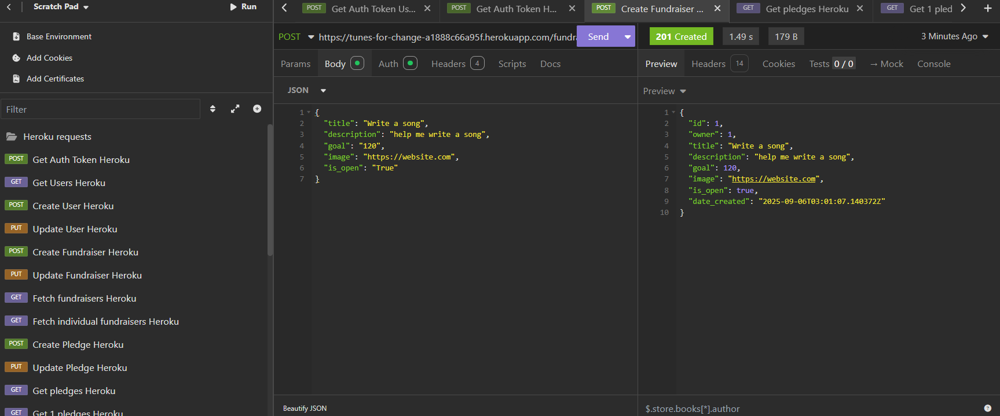
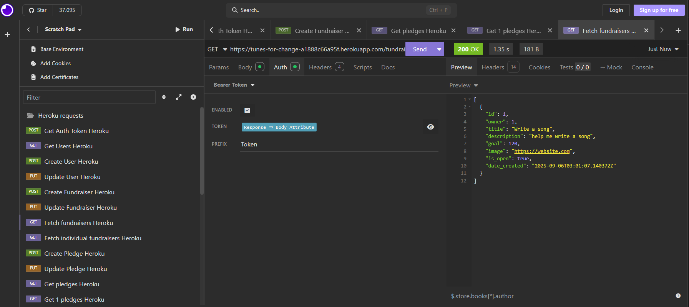
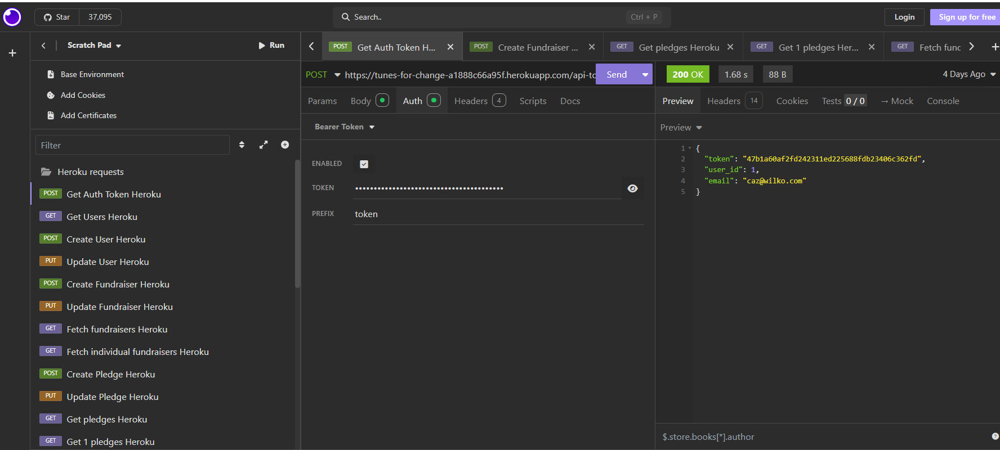

# Crowdfunding Back End
Carolyn Wilkinson

## Planning:
### Concept/Name - Tunes For Change

URL: https://tunes-for-change-a1888c66a95f.herokuapp.com/fundraisers/

My website will allow underprivileged children to post their ideas for musical projects that they would like to create, and musicians/music teachers will pledge time to meet with them online to assist them in creating their projects. 

### Intended Audience/User Stories
My intended audience consists of underprivileged/at risk children/teens who have ideas for musical projects that they would like to create, who will be posting the 'fundraisers'. The other part of my audience is the musicians/music teachers who will pledge their time to different projects to help them be completed. 

### Front End Pages/Functionality
- Home Page
  - Featured fundraiser
  - Logo
  - Title
  - List of other fundraisers
  - Log in button 
  - Menu
- Profile Page
  - User image
  - User details
  - Update details button
  - Pledges made
  - Fundraisers owned
- Search Page
  - Search bar
  - Results list
- Create new fundraiser page
  - Form with fundraiser details
  - Abilty to submit
  - Nice error pages for validation
- Display Fundraiser
  - Shows all information about fundraiser
  - Image
  - Show all pledges made so far
  - Shows whether the goal has been met or not

### How to create a user
1. Send a POST request in Insomnia to https://tunes-for-change-a1888c66a95f.herokuapp.com/users/
2. Input a user name and password into the 'Body' section, e.g. "username" : "user2",
	   "password" : "user2"
3. Create a new 'Get Auth Token' request in Insomnia, set up as a POST request. Input the new username and password, then send the request. 
4. Copy and paste the new token into the 'AUTH' section of the 'Get Auth Token User 2' for the new user in Insomnia
5. Check the new user is functioning as expected by running the 'Get Users' request in Insomnia, which is a GET request to the users page and ensure your new user is displayed. 
6. Check the permissions are working for your new user by creating a pledge with your new users Auth code and check that the pledge has gone through. 

### How to create a new fundraiser
1. Send a POST request in Insomnia to https://tunes-for-change-a1888c66a95f.herokuapp.com/fundraisers/
2. Input the following data: title, description, goal, image link, and is_open. 
3. Check your fundraiser has been successful by running a GET request to the fundraisers page to return the list of fundraisers. 
  
### API Spec

| URL           | HTTP Method | Purpose                   | Request Body | Success Response Code | Authentication/Authorisation             |
| ------------- | ----------- | ------------------------- | ------------ | --------------------- | ---------------------------------------- |
| /fundraisers/ | GET         | Fetch all the fundrasiers | N/A          | 200                   | None                                     |
| /fundraisers/ | POST        | Create a new fundraiser   | JSON Payload | 201                   | Any logged in user                       |
| /fundraisers/ | PUT         | Update fundraiser         | JSON Payload | 200                   | Logged in fundraiser owner               |
| /pledges/     | GET         | Fetch all the pledges     | N/A          | 200                   | Users who've pledged to the same project |
| /pledges/     | POST        | Creating a new pledge     | JSON Payload | 201                   | Logged in user                           |
| /pledges/     | PUT         | Update pledges            | JSON Payload | 200                   | Logged in pledge owner                   |
| /users/       | GET         | Fetch all users           | N/A          | 200                   | None                                     | Admin |
| /users        | POST        | Create new user           | JSON Payload | 201                   | None                                     |
| /users/       | PUT         | Update user               | JSON Payload | 200                   | Logged in user                           |
|               | POST        | Get Auth Token            | JSON Payload | 200                   | Anyone                                   |
### DB Schema

### Screenshots

#### Screenshot of Insomnia 'Create Fundraiser' POST request to my deployed project successfully creating a new fundraiser. 

#### Screenshot of Insomnia 'Get fundraisers' GET request successfully fetching all fundraisers from my deployed project. 

#### Screenshot of Insomnia 'Get Auth Token' request successfully retrieving auth token. 
